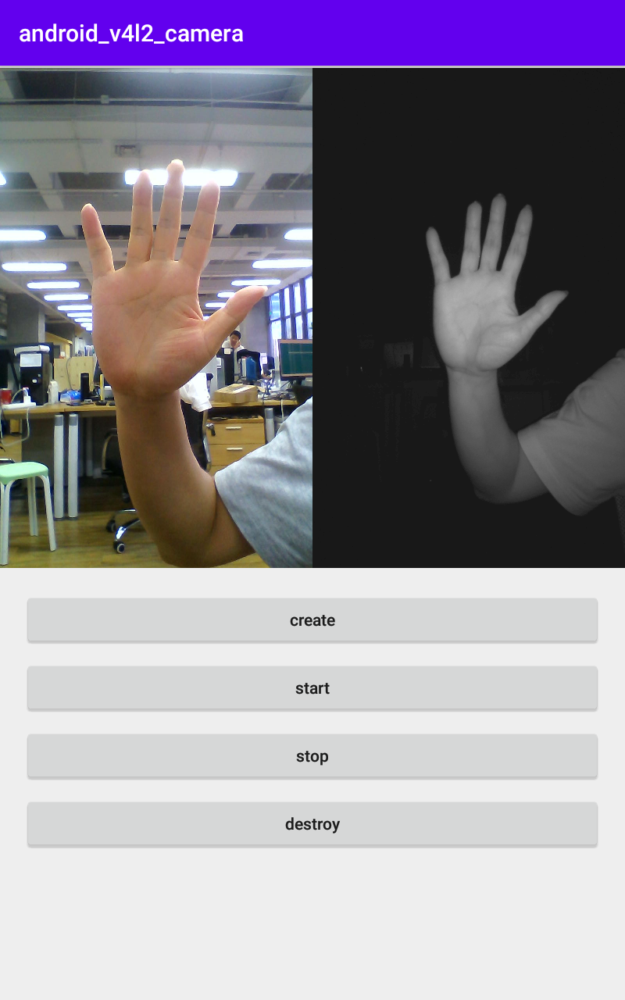
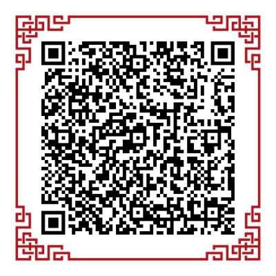

# android_camera_v4l2
android sample of v4l2 camera

### Image


### Sample
|  |
| :--------:                      |
| Scan QR code or [Download][1]   |

### Add Function
- 1.FPS 30 of Dual cameras.
- 1.Package Android camera based on V4L2 protocol.
- 2.Support setting resolution and original format of image acquisition: MJPEG, YUYV
- 3.Use NdkMediaCodec for MJPEG decoding. If the device does not support hard decoding,
    it is recommended to use libjpeg-turbo instead of HwDecoder.
- 4.Support OpenGL ES rendering YUYV, NV12, NV21, DEPTH and other image formats.

### About Build
- CMake: 3.10.2
- Android Studio 4.0

### About Author:
- Author: shengjunhu
- Date  : 2021/5/12
- E-Mail: shengjunhu@foxmail.com
- GitHub: https://github.com/hushengjun

### About License
```
Copyright (c) 2020 shengjunhu
Please compliance with the MIT license
```

[1]: https://github.com/shengjunhu/android_camera_v4l2/raw/master/doc/apk/sample_camera_v4l2_v21051216_debug.apk